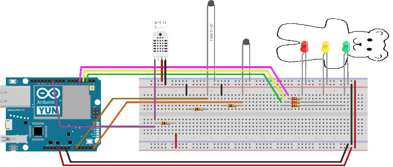

# Termorsetti

An Arduino project to monitor temperature and humidity to a web
server, all while having gummi bears with lights inside.



# Circuitry

Required hardware:

* Arduino Yun with an additional SD card mounted as overlay

* 2 thermistors

* one DHT11 digital temperature/humidity module

* 3 LEDs and a gummi bear

* 3 10kOhm resistors

* 3 220 Ohm resistors

Wires and a means to protect one thermistor from rain, etc (e.g. sealed inside a non-inflated balloon with some hygroscopic grains thrown in for good measure)

# Sketch

A library is required: DHT library (https://github.com/adafruit/DHT-sensor-library)

# Arduino Yun setup

On the openWrt installation one must do as described in http://bradsduino.blogspot.it/2013/10/installing-php-on-arduino-yun.html, i.e. run the following commands:

```
    opkg update
    opkg install php5-cgi
    uci set uhttpd.main.interpreter=".php=/usr/bin/php-cgi"
    uci set uhttpd.main.index_page="index.html index.htm default.html default.htm index.php"
    uci commit uhttpd
    sed -i 's,doc_root.*,doc_root = "",g' /etc/php.ini
    sed -i 's,;short_open_tag = Off,short_open_tag = On,g' /etc/php.ini
    /etc/init.d/uhttpd restart
```

# Status


It is a work in progress
